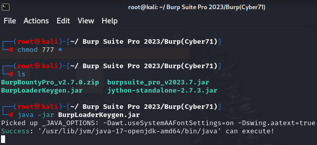

<!-- omit in toc -->
# Burp Suite Professional 2023 Installation Guideline for Kali Linux

<!-- omit in toc -->
## Table of Content

- [Installation](#installation)
- [Create Launcher for Burp Suite](#create-launcher-for-burp-suite)
- [Burp Suite Extensions](#burp-suite-extensions)
  - [Burp Bounty Pro](#burp-bounty-pro)
  - [Logger++](#logger)
- [Configure Burp Suite Pro 2023](#configure-burp-suite-pro-2023)
  - [Install PwnFox Extension on Browser](#install-pwnfox-extension-on-browser)
  - [Install CA Certificate](#install-ca-certificate)

## Installation

1.	File name: Burp(Cyber71)-20230726T032814Z-001.zip
2. Download link: https://drive.google.com/drive/folders/1pudxub7zVYe1eG6fhT5wFtHlNLRyQO01
3.	Open kali Linux and download Burp Suite Pro 2023 from the link.
4.	Create a new folder in /root, i.e., 'Burp Suite Pro 2023'.

```bash
mkdir /root/'Burp Suite Pro 2023'
cd /root/'Burp Suite Pro 2023'
```

5.	Paste and extract the zip file to “Burp Suite Pro 2023” folder.

```bash
mv /root/Downloads/Burp(Cyber71)-20230726T032814Z-001.G_erqkY7.zip /root/'Burp Suite Pro 2023'/ 

unzip Burp(Cyber71)-20230726T032814Z-001.G_erqkY7.zip
```

6.	Give permission:
```bash
chmod 777 *
```
7.	Open `Burp(Cyber71` and run `BurpLoaderKeygen.jar`

```bash
cd 'Burp(Cyber71)'
java -jar BurpLoaderKeygen.jar
```




8.	Then the following window will appear:  
Here, change 2 options:  
    a.	Check the “Ignore Update”.  
    b.	Change the License owner name (optional).

Then `Run` the program.


9.	Then follow accordingly:


10.	License key window will appear:


11.	Follow accordingly:


12.	Click on “Manual activation”.


13.	Follow accordingly:

    


14.	Click on Next and the license will be successfully installed.    
    
  

15.	Now open a Temporary Project.


  
16.	Now close Burp Suite.
17.	To run it again, we need to go to `/root/'Burp Suite Pro 2023'/Burp(Cyber71)` and run the following command again:
```bash
java -jar BurpLoaderKeygen.jar
```

18.	This starting process is not convenient. So we need to start a launcher for Burp Suite for easy opening.


## Create Launcher for Burp Suite

19.	Go to `/root/'Burp Suite Pro 2023/Burp(Cyber71)'/` and create a file named `runBurp.sh`.

```bash
touch runBurp.sh
```
20.	Give executable permission:

```bash
chmod +x RunBurp.sh
```
21.	Now run Burp Suite pro 2023 with terminal using the following command:

```bash
java -jar BurpLoaderKeygen.jar
```

Copy the `Loader Command`.


22.	Then paste the loader command to `runBurp.sh` and save it.

23.	And run Burp Suite
```bash
./runBurp.sh
```

24.	If it opens Burp Suite, then go to browser and download an icon of Burp Suite.
25.	Go to Desktop. Right click and click on `Create Launcher`.


26.	`Name`: Any Name  
`Command`: Path to runBurp.sh  
`Working Directory`: Path to the directory of runBurp.sh  
`Icon`: No Icon > Image File > Path to the downloaded Burp suite icon  

Then Click on Create and open the Burp Suite Pro 2023 from Desktop.


## Burp Suite Extensions

### Burp Bounty Pro

1. Open Burp Suite and go to Settings at top-right corner.


2. Go to Extensions and from Python environment select Jython file located at `/root/ Burp Suite Pro 2023/Burp(Cyber71)/jython-standalone-2.7.3.jar`.


3.	Close it and go to Extensions > Add


4.	From “Extension details”, select “.jar” file from the following path
`/root/ Burp Suite Pro 2023/Burp(Cyber71)/BurpBountyPro_v2.7.0/BurpBountyPro.jar`.  
*If 'BurpBountyPro_v2.7.0' is a zip file, unzip it*


5.	Then the following window will appear. Close it.


6.	Go to Burp Bounty Pro > License. 
Then press “Activate” and we have a lifetime activated license.


7.	To activate Burp Bounty rules, go to `Burp Bounty Pro` > `Options` > `Burp Bounty Data` > then select the following directory: `/root/ Burp Suite Pro 2023/Burp(Cyber71)/BurpBountyPro_v2.7.0/BurpBountyPro_v2.7.0/BurpBountyData/`


### Logger++


1.	Go to `Extensions` > `BApp Store` > Search for `Logger++` > Install it.  

**Caution: Logger++ has a high system impact**


## Configure Burp Suite Pro 2023

### Install PwnFox Extension on Browser

1.	Search for `PwnFox` extension in `Firefox browser` and install it.
2.	Enable PwnFox extension and check `Proxify all tabs`
.


### Install CA Certificate
1.	**In Burp Suite, Intercept should be closed (Proxy > Intercept > Intercept is off)**
2.	Go to Firefox browser and enable PwnFox.
3.	Search for `http://burp` and download `CA Certificate`


4.	Go to Settings of Firefox and search for `certificate`. Click on `View Certificate` > `Authorities` > `Import` > `Select the CA certificate file`

  
  

5.	Check “Trust this CA to identify websites” and press OK.


6. Now Firefox is connected to Burp Suit. 

*********************************** THE END ***************************************


