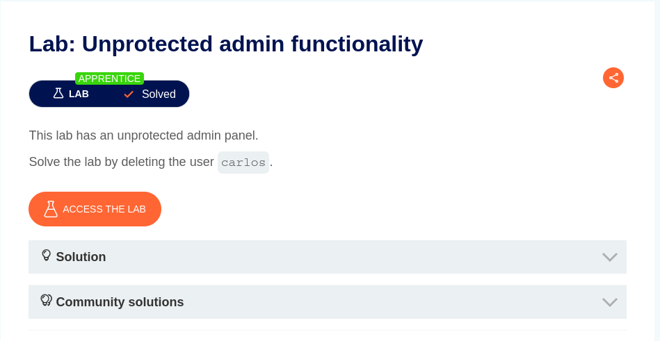
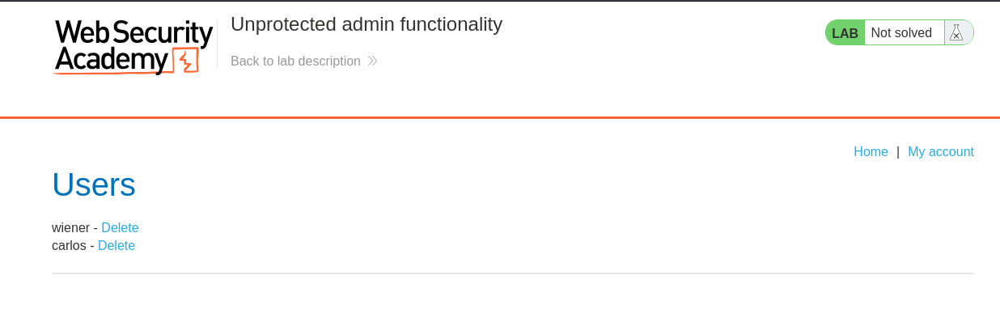

# Lab-01 Unprotected admin functionality

## Objective



## Solution

1. Add `/robots.txt` to the end of the URL.

```
User-agent: *
Disallow: /administrator-panel
```

2. Found the Admin Panel. Add `/administrator-panel` to the end of the URL.



3. Get access to the Admin Panel.


# Lab-02