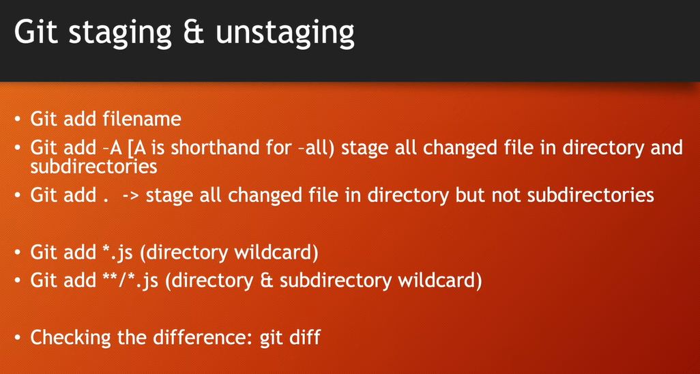

# Git Staging & Unstaging

## Working directory to Staging Area

### To add a single file
`git add file1.txt`

### To add all files in current directory
`git add .`

### To add all files and directories to staging area
`git add -A`

### To check git status
`git status`

* files are now moved to the staging area.

### Change a file's data
`notepad file1.txt`

### To check git status again
`git status`

* "modified: file1.txt" is showed.

### To add the modified file to staing area again
`git add file1.txt`

### To unstage a file
`git rm --cached file1.txt`

### To unstage current folder
`git rm --cached . -f -r`

### To restore a file to it's previous version
`git restore file1.txt`

### To check what changes made in a file
`git diff file1.txt`

