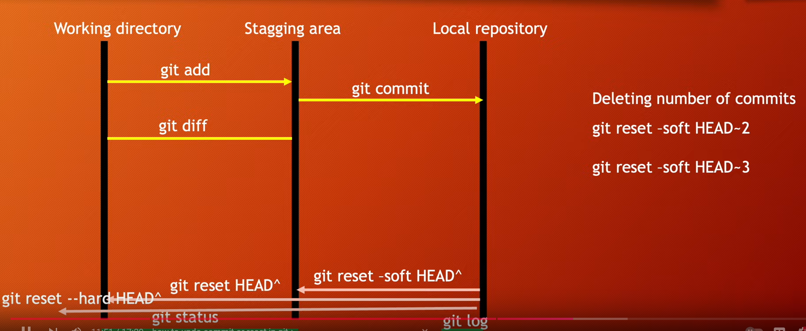

# Git Commit & Uncommit

## Git Commit (Staging Area to Local Repository)

### Commit a single file
`git commit file1.txt -m "write understandable messege here"`

### commit all files
`git commit --all -m "write understandable messege here"`

### To see Commit history
`git log`

### To see Commit history in One Line
`git log --oneline`

### To commit a file directly to local repository

**Method 1** 
`git commit -am "write understandable messege here"`
> [!Warning]
> Not Recommended
> Git may not track sometimes

**Method 2**
`git add . && git commit -m "understandable messege"`

## Uncommit 
[!Warning]
> "Git reset" is a risky method

`git reset --soft HEAD^`
> To uncommit last commit and send back to staging area

`git reset HEAD^`
> To uncommit last commit, and send all files in staging area and last commites file back to working directory

`git reset --hard HEAD^`
> To uncommit completely 
> Delete last commited file
> Delete all uncommited files
> Reset everything to the previous commit 

`git reset --soft HEAD~2`
> To uncommit last two commits and send them back to staging area

`git reset --soft HEAD~3`
> To uncommit last three commits and send them back to staging area

