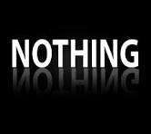

# Markdown(.md) Format


## Comment
\<!--Comment here-->

### Shortcut for Comment and Uncomment
Ctrl + /

## Normal Text
This is a normal text.  
Line 2  
Line 3

## Next Line
- Double Space (  )
- \<br>

## Horizontal Rule
- Triple dash (---)
- This is for horizontal rule <hr>

## Headings

# Head1
## Head2
### Head3
#### Head4
##### Head5
###### Head6

## Paragrgaph
<P>I am Taukir. I am doing my Masters in Cyber Security in Daffodil International University. Besides I am working for Green Cybersec Ltd. as an intern. </p>

## Italic format
- \<i> italic format \</i>
- \*Italic format 2*
- \_Italic format 2_

## Bold / Strong format
- \<b> Bold format \</b>
- __Bold Format2__
-  **Bold Format3**


## Strike Through
- \<del> Strike Through word \</del>
- \~~Strike Through word2~~

## Inline and Multi line Code Block
`Single line code`

```python
a=10
b=2
sum=a+b
```

## List

### Ordered List
1. apple
2. banana
    1. juice
    2. jam
3. orange

### Unordered List
- rana
    - mina
    - pina
    - bina
- kana
- pana

## Task List
- [x] Introduction
- [x] literature review
- [] methodology

## Link Syntax

### Automatic Link
https://www.google.com

### Disable Link
`https://www.google.com`


### Markdown Link Syntax
[title](https://link.com)

[Google](https://google.com)

## Image Syntax





 

## Emoji

[Emojipedia](https://emojipedia.org/)

🧔


## Table
 
| Name | Email | Contact |
|---|---|---|
|Taukir | taukir@gmail.com | 01XXXXXX|
|aaa | aaa@gmail.com | 01XXXXXX|
|bbb | bbb@gmail.com | 01XXXXXX|

