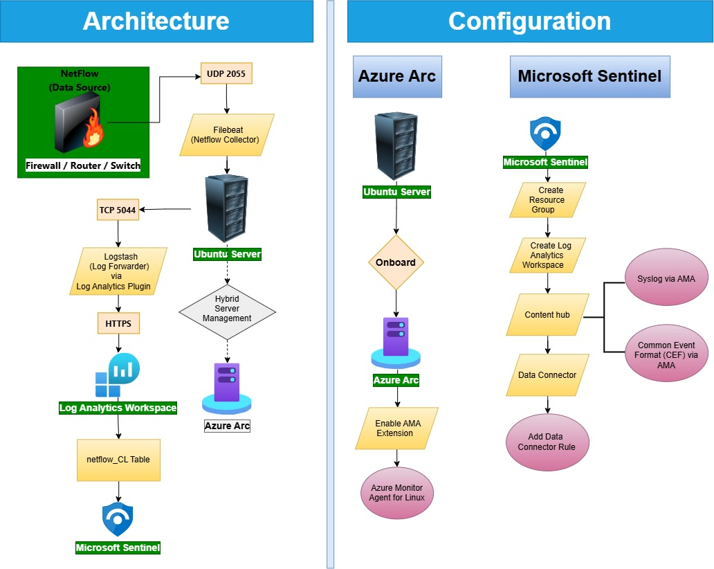

<!-- omit in toc -->
# NetFlow-to-Sentinel-Integration

<!-- omit in toc -->
## Table of Content

- [Architecture](#architecture)
- [Create Resource Group in Azure Subscriptions Portal](#create-resource-group-in-azure-subscriptions-portal)
- [Create Virtual Machine - Ubuntu](#create-virtual-machine---ubuntu)
- [Azure Arc](#azure-arc)
  - [Onboarding to Azure Arc](#onboarding-to-azure-arc)
  - [Enable AMA extension](#enable-ama-extension)
- [Microsoft Sentinel Configuration](#microsoft-sentinel-configuration)
  - [Create New Analytics Workspace](#create-new-analytics-workspace)
  - [Add Data Connector](#add-data-connector)
    - [Create Data Collection Rule](#create-data-collection-rule)
- [Configure Logstash](#configure-logstash)
  - [Install Logstash in Ubuntu (Syslog Server)](#install-logstash-in-ubuntu-syslog-server)
  - [Verify the installation by writing a few log lines to the console](#verify-the-installation-by-writing-a-few-log-lines-to-the-console)
  - [Install the Azure Log Analytics plugin](#install-the-azure-log-analytics-plugin)
  - [Adding Log Analytics Workspace key](#adding-log-analytics-workspace-key)
  - [Create the Configuration file `generator-to-sentinel.conf`](#create-the-configuration-file-generator-to-sentinelconf)
  - [Run the pipeline](#run-the-pipeline)
    - [Test in Sentinel Log:](#test-in-sentinel-log)
  - [Troubleshooting:](#troubleshooting)
- [Setup Filebeat](#setup-filebeat)
  - [Install Filebeat](#install-filebeat)
  - [Have Filebeat listen for NetFlow UDP traffic on localhost:2055](#have-filebeat-listen-for-netflow-udp-traffic-on-localhost2055)
  - [Configure `netflow.yml` file](#configure-netflowyml-file)
  - [Configure `filebeat.yml` file](#configure-filebeatyml-file)
    - [Testing for filebeat log flow:](#testing-for-filebeat-log-flow)
  - [Create `filebeat-to-stdout.conf` Configuration file](#create-filebeat-to-stdoutconf-configuration-file)
    - [For Testing, run Logstash:](#for-testing-run-logstash)
    - [Run Filebeat](#run-filebeat)
- [Enable Firewall in Ubuntu](#enable-firewall-in-ubuntu)
- [Troubleshooting](#troubleshooting-1)
  - [Kill persistent logstash process](#kill-persistent-logstash-process)
- [Error fix](#error-fix)


# Architecture



---

# Create Resource Group in Azure Subscriptions Portal
```
RG-Taukir
```

# Create Virtual Machine - Ubuntu

Create Virtual Machine (Ubuntu) anywhere but not in Azure VM.


# Azure Arc

## Onboarding to Azure Arc

Check the [Onboarding to Azure Arc Script](./Onboarding-to-Azure-Arc.sh)

## Enable AMA extension
1. Open Onboarded Linux machine
2. Open Settings
3. Enable Azure Monitor Agent for Linux 

# Microsoft Sentinel Configuration

## Create New Analytics Workspace
- Create with a meaningful name.


## Add Data Connector
1. CEF via AMA
2. Syslog via AMA


### Create Data Collection Rule
1. Rule Name: DCR-CEF-Taukir

2. Convert the following forwarder command 

```
sudo wget -O Forwarder_AMA_installer.py https://raw.githubusercontent.com/Azure/Azure-Sentinel/master/DataConnectors/Syslog/Forwarder_AMA_installer.py&&sudo python Forwarder_AMA_installer.py
```

**To**

```
sudo wget -O Forwarder_AMA_installer.py https://raw.githubusercontent.com/Azure/Azure-Sentinel/master/DataConnectors/Syslog/Forwarder_AMA_installer.py&&sudo python3 Forwarder_AMA_installer.py
```
Changes made : **[python --> python3]**


# Configure Logstash


## Install Logstash in Ubuntu (Syslog Server)

```bash
wget -qO - https://artifacts.elastic.co/GPG-KEY-elasticsearch | sudo apt-key add - 

echo "deb https://artifacts.elastic.co/packages/7.x/apt stable main" | sudo tee -a /etc/apt/sources.list.d/elastic-7.x.list 

sudo apt-get update 

sudo apt-get install logstash 

sudo chmod -R 777 /var/log/logstash 

sudo chmod -R 777 /var/lib/logstash 

cd /usr/share/logstash 

sudo bin/logstash-keystore --path.settings /etc/logstash create 
```

## Verify the installation by writing a few log lines to the console

```bash
bin/logstash --path.settings /etc/logstash -e 'input { generator { count => 10 } } output { stdout {} }' 
```

## Install the Azure Log Analytics plugin

```bash
sudo bin/logstash-plugin install microsoft-logstash-output-azure-loganalytics
```

## Adding Log Analytics Workspace key

1. Get the Log Analytics workspace key (Primary key and Secondary key) from the `Cloud Shell` inside `Azure Portal`.

```
az monitor log-analytics workspace get-shared-keys --resource-group RG-Taukir --workspace-name sentinel-taukir
```

Output:
```
{
  "primarySharedKey": "XXXXXXXXXXXXXXXXXXXXXXXXX",
  "secondarySharedKey": "ZZZZZZZZZZZZZZZZZZZZZZZ"
}
```

2. Store the Log Analytics workspace key in the Logstash key store.   


3. Command to add loganalyticskey

```bash
sudo bin/logstash-keystore --path.settings /etc/logstash add loganalyticskey 
```
The command prompts for the key found in `#1 Output` (**primarySharedKey**). 


## Create the Configuration file `generator-to-sentinel.conf`


Location: `/etc/logstash/generator-to-sentinel.conf`

Get the **Workspace ID** from below:

`Azure Portal` > `Log Analytics Workspace` > `[Select Workspace Name]` > `Properties` > `Workspace ID`


```conf
input { 
    stdin {} 
    generator { count => 10 } 
} 
output { 
    stdout {} 
    microsoft-logstash-output-azure-loganalytics { 
        workspace_id => "9e7e865a-7ffd-4752-8319-6a6fc7909de6" 
        workspace_key => "${loganalyticskey}" 
        custom_log_table_name => "netflow" 
    } 
} 
```
This will create a table called `netflow_CL` in Azure Sentinel. 


**NOTE:**   
**Sentinel will automatically add `_CL` after the table name.**


## Run the pipeline

**Go to logstash location**
```
cd /usr/share/logstash 
```

**For Debug Mode**  

Run Logstash in Debug Mode (Troubleshooting - Continuous log flow)

```bash
sudo bin/logstash --debug --path.settings /etc/logstash -f /etc/logstash/generator-to-sentinel.conf
```


**For Normal Operation**  

Run Logstash Pipeline (Production Mode)

```bash
sudo bin/logstash --path.settings /etc/logstash -f /etc/logstash/generator-to-sentinel.conf
```

### Test in Sentinel Log: 

```
netflow_CL
| take 10
```

## Troubleshooting:

Check Which Plugin is Installed

```bash
sudo /usr/share/logstash/bin/logstash-plugin list | grep microsoft
```

Check Logstash Version

```bash
/usr/share/logstash/bin/logstash --version
```

Check Plugin Directory

```bash
ls -la /usr/share/logstash/vendor/bundle/jruby/*/gems/ | grep microsoft
```

# Setup Filebeat 

## Install Filebeat

```bash
sudo apt-get install filebeat 
sudo chmod 644 /etc/filebeat/filebeat.yml 
sudo mkdir /var/lib/filebeat 
sudo mkdir /var/log/filebeat 
sudo chmod -R 777 /var/log/filebeat 
sudo chmod -R 777 /var/lib/filebeat 
cd /usr/share/filebeat 
```

## Have Filebeat listen for NetFlow UDP traffic on localhost:2055 

```bash
sudo filebeat modules enable netflow 
```
Output:
```
Enabled netflow
```

## Configure `netflow.yml` file

Location:
```bash
/etc/filebeat/modules.d/netflow.yml
```

Give Writable permission

```bash
 sudo chmod 666 /etc/filebeat/modules.d/
 sudo chmod go-w /etc/filebeat/modules.d/netflow.yml
```

Change the value of `netflow_host` to the IP of Ubuntu device:

```ini
# Module: netflow
# Docs: https://www.elastic.co/guide/en/beats/filebeat/7.17/filebeat-module-netflow.html

- module: netflow
  log:
    enabled: true
    var:
      netflow_host: 172.19.232.201
      netflow_port: 2055
      # internal_networks specifies which networks are considered internal or private
      # you can specify either a CIDR block or any of the special named ranges listed
      # at: https://www.elastic.co/guide/en/beats/filebeat/current/defining-processors.html#>
      internal_networks:
        - private
```

## Configure `filebeat.yml` file

Location:  
`/etc/filebeat/filebeat.yml`


Instructions:


- Comment out the section `output.elasticsearch`  
- Uncomment the section `output.logstash`  

Check full [filebeat.yml](./filebeat.yml) file here. 


### Testing for filebeat log flow:

Check whether Filebeat can parse the configuration:

```bash
sudo filebeat test config
```

output:
```
Config OK
```

Check whether Filebeat can reach Logstash:

```bash
sudo filebeat test output
```

## Create `filebeat-to-stdout.conf` Configuration file

Location:   
`/etc/logstash/filebeat-to-stdout.conf`

Paste below configuration [**replace Workspace ID**]

```ini
input { 
    beats { 
        port => 5044 
    } 
} 
output { 
    stdout {} 
microsoft-logstash-output-azure-loganalytics { 
        workspace_id => "9e7e865a-7ffd-4752-8319-6a6fc7909de6" 
        workspace_key => "${loganalyticskey}" 
        custom_log_table_name => "netflow" 
    } 
}
```

### For Testing, run Logstash: 


```bash
cd /usr/share/logstash/ 

bin/logstash --debug --path.settings /etc/logstash -f /etc/logstash/filebeat-to-stdout.conf
```

### Run Filebeat 

In another terminal, run Filebeat: 

```bash
sudo filebeat run -e
```

# Enable Firewall in Ubuntu 

```bash
sudo ufw enable 
sudo ufw allow from any to any port 2055 proto udp 
sudo ufw status verbose 
```

# Troubleshooting

## Kill persistent logstash process

```
ps -ef | grep logstash
sudo kill -9 91709
```

```
-e ==> grab system process  
-f ==> grab full format list which includes process ID
-9 ==> Kill the process forcefully
```


Verify:
```
ps -ef | grep logstash
```


# Error fix

**Find the process:**
```bash
ps -ef | grep logstash
```

Example Output:

```bash
root 99265 1 0 Sep09 ? 00:01:10 /usr/share/logstash/bin/logstash
ubuntu 100123 100100 0 15:50 pts/0 00:00:00 grep --color=auto logstash
```

**Forcefully kill the process (Single Process):**

```bash
kill -9 99265
```

**Forcefully kill all processes named logstash (Kill multiple processes):**

```bash
sudo pkill -9 logstash
```

**Forcefully kill all processes named with multiple names (Kill multiple processes):**

```bash
sudo killall -9 java logstash filebeat
```

**Run Logstash in Debug Mode**

```bash
sudo bin/logstash --debug --path.settings /etc/logstash -f /etc/logstash/generator-to-sentinel.conf
```
