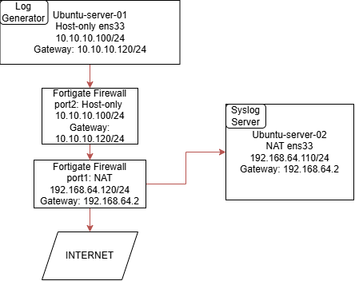
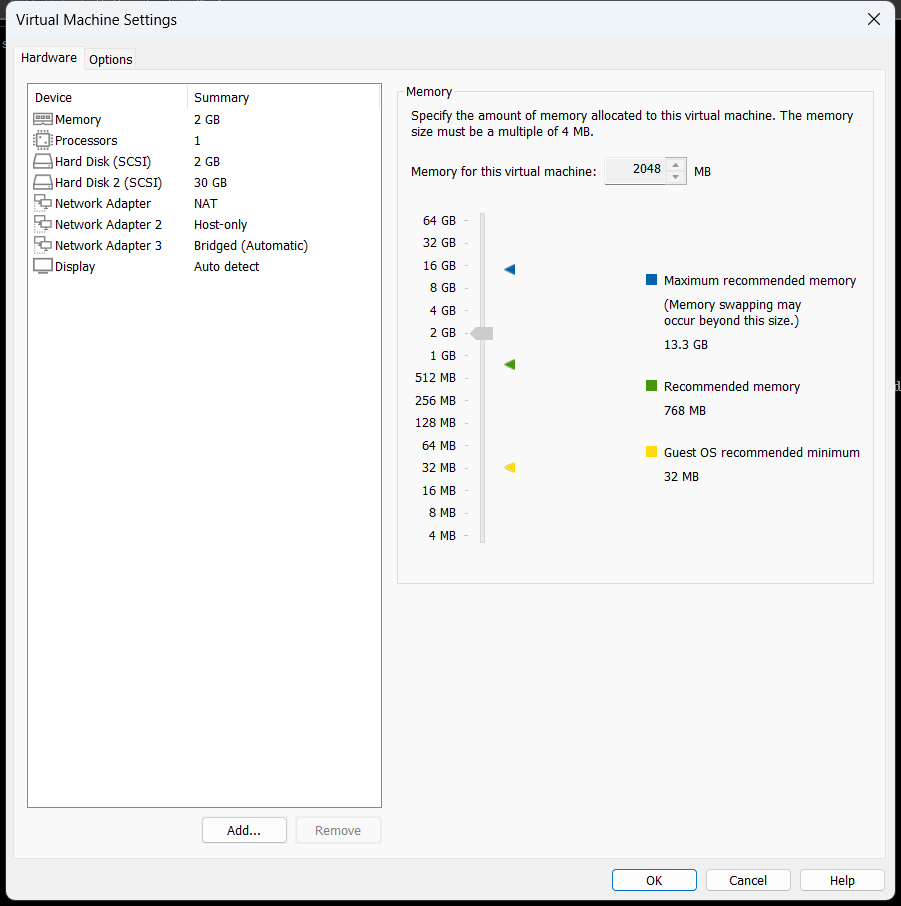
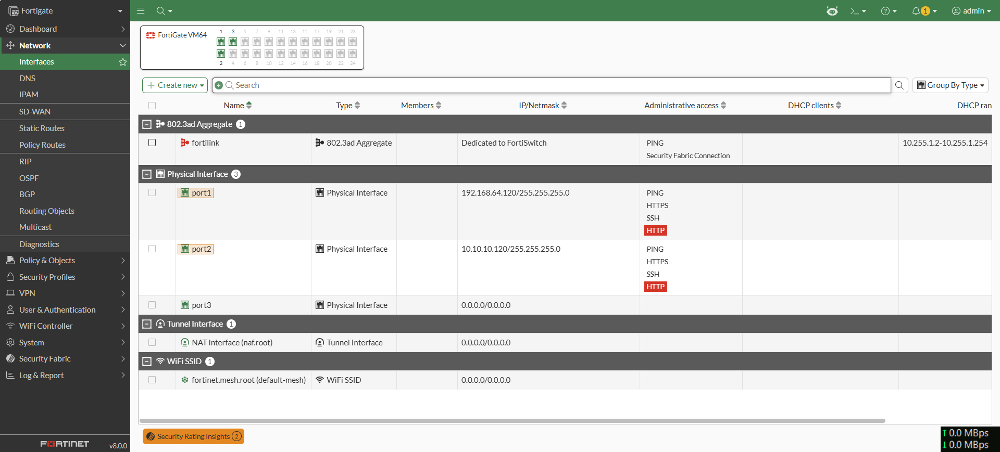
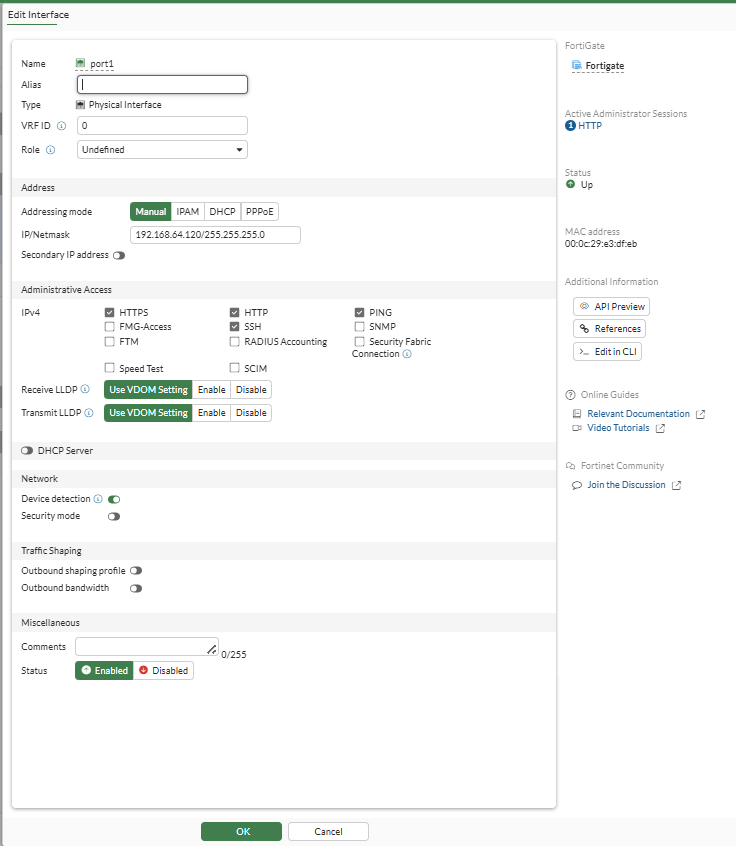
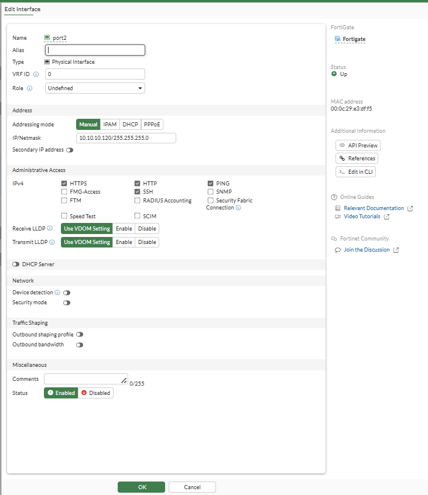
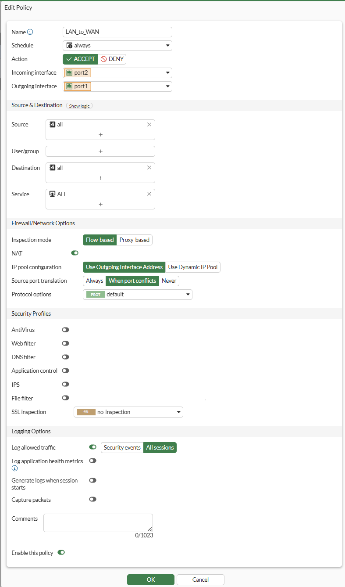
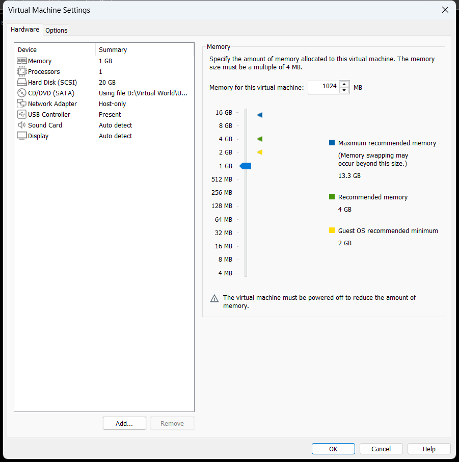
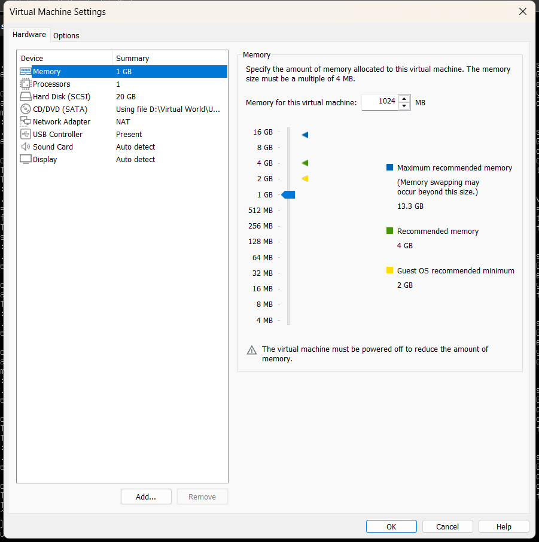
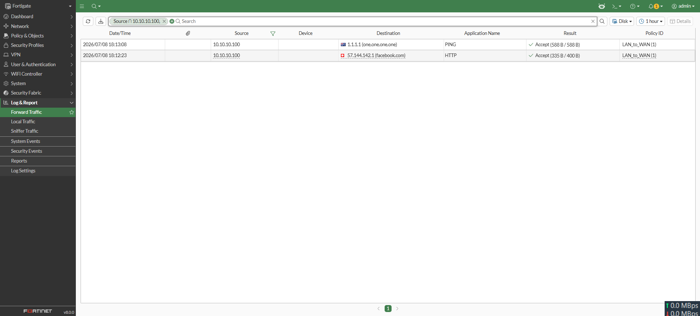
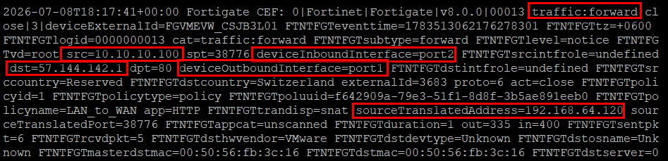

# Basic Architecture
```
Server-01 ──Syslog──► FortiGate
Server-03 ──Syslog──► FortiGate
Server-04 ──Syslog──► FortiGate

FortiGate ──Syslog/CEF──► Ubuntu Collector (Server-02)
                                 │
                                 │ AMA Connector
                                 ▼
                            Sentinel
``` 



```
Ubuntu-01 
10.10.10.100
      │
      ▼
FortiGate LAN
10.10.10.120
      │
      ▼
FortiGate WAN
192.168.64.120
      │
      ▼
Internet


```


# Credentials
## Fortinet Firewall
```
Fortigate
login : admin
pass : Taukir@123456
Interface: NAT
port1: 192.168.64.120/24
```
## Log Generator (server-01)

```
Ubuntu-server-01
user: ubuntu
pass: 1212
Interface: NAT ens33
IP Address: 192.168.64.100/24
```
## Log Collector (server-02)

```
Ubuntu-server-02
user: ubuntu
pass: 1212
Interface: NAT ens33
IP Address: 192.168.64.110/24
```


# Netplan Configuration for Static IP (Ubuntu Server)
```
network:
  version: 2
  renderer: networkd
  ethernets:
    ens33:
      addresses:
        - 192.168.64.128/24
      routes:
        - to: default
          via: 192.168.64.2
      nameservers:
        addresses:
          - 8.8.8.8
          - 1.1.1.1
```

# Fortigate Commands:
```
? # Show available commands 

get system status
show
config system interface
get system interface
execute ping 8.8.8.8
```


# Configure Static IP on FortiGate:
```
config system interface
edit port1
set mode static
set ip 192.168.64.120 255.255.255.0 # Static IP
set allowaccess ping https ssh http  # Allow services
next
end
```

# Configure Default Route
```
config router static
edit 1
set gateway 192.168.64.2
set device port1
next
end
```

## Verify IP and Route Configuration:
```
get system interface
get router info routing-table all
execute ping 8.8.8.8
```

# Log Relaying
## server-02 (Log collector)
```
sudo tcpdump -nn -A host 192.168.64.120 and port 514
```

## server-1 (Log Generator)
```
logger "FORTI_RELAY_TEST_001"
```

=====================
# Fortigate Firewall

## Install Fortigate Firewall

- Create account in fortinet
- Download image from [Fortigate VM Download Link](https://support.fortinet.com/support/#/downloads/vm)
- Install Fortigate Firewall VM in VMware.
- Default Credentials:  
Username: admin  
Password: [No Default Password]
- Create New Password while first login on VM.
- Get fortigate IP address and login via web browser.
- **Enable Fortigate Evoluation License.** 
  
## Basic Fortigate CLI Commands
```
show
# Show Available Commands
```
```
get system interface
# Show all interfaces and IP addresses
```

```
get system status
# Show FortiGate version, serial, hostname, uptime, current time
```

```
show system global
# Display global system configuration
```

```
execute ping 8.8.8.8
# Test internet connectivity
```

```
#Set Bangladesh Timezone

config system global 
set timezone "Asia/Dhaka"
end

show system global | grep timezone
#Check Timezone
```

## Add Interfaces in VMware



## Configure Network Interface via GUI (Option-1)
Fortinet requires two Network Interfaces, NAT and Host-only.





## Configure Network Interface via Command Line (Option-2)

### Port1 (NAT Interface)
```
config system interface
edit port1
set mode static
set ip 192.168.64.120 255.255.255.0
set allowaccess ping https ssh http
next
end
```

### Port2 (Host-only Interface)
```
config system interface
edit port2
set mode static
set ip 10.10.10.120 255.255.255.0
set allowaccess ping https ssh http
next
end
```

### Configure Default Route

```
config router static
edit 1
set gateway 192.168.64.2
set device port1
next
end
```

## Create Cusom Policy

### Firewall Policy via GUI



### Firewall Policy via CLI
```
config firewall policy
edit 1
set name "LAN_to_WAN"
set srcintf "port2"
set dstintf "port1"
set srcaddr "all"
set dstaddr "all"
set action accept
set schedule "always"
set service "ALL"
set nat enable
next
end
```


## Forward Traffic to Syslog Server

> **[!NOTE]**
> 
> First configure a Syslog server and get the Syslog server IP Address.

```
config log syslogd setting
set status enable
set format cef
set port 514
set server 192.168.64.110
end
```
# Log Generator Server
> **[!NOTE]**
> 
> Server Should be at Host-only Interface

## Add Interface in VMware



## Configure Netplan for Static IP

**Location:** `/etc/netplan/50-cloud-init.yaml`

```
network :
  version: 2
  renderer: networkd

  ethernets:
    ens33:
      addresses:
        - 10.10.10.100/24
      routes:
        - to: default
          via: 10.10.10.120
      nameservers:
        addresses:
        - 8.8.8.8
        - 1.1.1.1
```
Then 

```
netplan apply
```

# Syslog Server
## Add Interface in VMware




## Configure Netplan for Static IP

**Location:** `/etc/netplan/50-cloud-init.yaml`

```
network:
  version: 2
  renderer: networkd
  ethernets:
    ens33:
      addresses:
        - 192.168.64.110/24
      routes:
        - to: default
          via: 192.168.64.2
      nameservers:
        addresses:
          - 8.8.8.8
          - 1.1.1.1
```
Then 
```
netplan apply
```

Check Gateway : `ip route`

Check DNS Server : `resolvectl`

# Testing
## On Log Generator Server

```
ping 1.1.1.1
curl facebook.com
```

## Check on Firewall 



## Check on Syslog Server

Destination shows the Facebook IP address.



