# Fortigate-Syslog-Sentinel Lab <!-- omit in toc -->

## Table of Content <!-- omit in toc -->
- [Basic Architecture](#basic-architecture)
- [Fortigate Firewall](#fortigate-firewall)
  - [Install Fortigate Firewall](#install-fortigate-firewall)
  - [Basic Fortigate CLI Commands](#basic-fortigate-cli-commands)
  - [Add Interfaces in VMware](#add-interfaces-in-vmware)
  - [Configure Network Interface via GUI (Option-1)](#configure-network-interface-via-gui-option-1)
  - [Configure Network Interface via Command Line (Option-2)](#configure-network-interface-via-command-line-option-2)
    - [Port1 (NAT Interface)](#port1-nat-interface)
    - [Port2 (Host-only Interface)](#port2-host-only-interface)
    - [Configure Default Route](#configure-default-route)
  - [Create Cusom Policy](#create-cusom-policy)
    - [Firewall Policy via GUI](#firewall-policy-via-gui)
    - [Firewall Policy via CLI](#firewall-policy-via-cli)
  - [Forward Traffic to Syslog Server](#forward-traffic-to-syslog-server)
- [Log Generator Server](#log-generator-server)
  - [Add Interface in VMware](#add-interface-in-vmware)
  - [Configure Netplan for Static IP](#configure-netplan-for-static-ip)
- [Syslog Server](#syslog-server)
  - [Add Interface in VMware](#add-interface-in-vmware-1)
  - [Configure Netplan for Static IP](#configure-netplan-for-static-ip-1)
- [Testing](#testing)
  - [On Log Generator Server](#on-log-generator-server)
  - [Check on Firewall](#check-on-firewall)
  - [Check on Syslog Server](#check-on-syslog-server)
  - [Architecture So Far:](#architecture-so-far)
- [Onboard Syslog Server to Azure Arc](#onboard-syslog-server-to-azure-arc)
  - [Prerequisites](#prerequisites)
  - [Onboard the Syslog Server to Azure Arc](#onboard-the-syslog-server-to-azure-arc)
  - [Enable AMA extension](#enable-ama-extension)
  - [Bonus](#bonus)
- [Microsoft Sentinel Configuration](#microsoft-sentinel-configuration)
  - [Add Data Connector](#add-data-connector)
    - [Create the Data Collection Rule (DCR)](#create-the-data-collection-rule-dcr)
    - [Install the Fortinet Solution](#install-the-fortinet-solution)
    - [Install the CEF Collector](#install-the-cef-collector)
  - [Validate Logs in Microsoft Sentinel](#validate-logs-in-microsoft-sentinel)
- [Troubleshooting](#troubleshooting)

# Basic Architecture
```
Server-01 ──Syslog traffic──► FortiGate──►Internet
                                  │
                                  ▼
                            Syslog/CEF log ──► syslog server
                                                  │
                                                  │ AMA Connector
                                                  ▼
                                              Sentinel
``` 

```
FortiGate
   ↓ CEF / UDP 514
Ubuntu Syslog Server
   ↓
Azure Arc
   ↓
AzureMonitorLinuxAgent (AMA) ← Required
   ↓
DCR (LOCAL7 / NOTICE)
   ↓
Log Analytics Workspace
   ↓
CommonSecurityLog
   ↓
Microsoft Sentinel
```

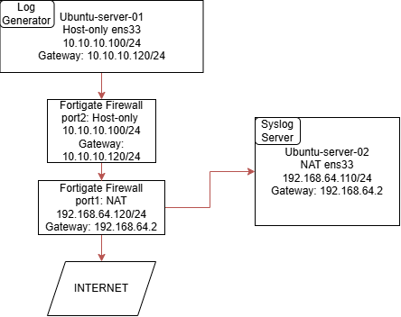


# Fortigate Firewall

## Install Fortigate Firewall

- Create account in fortinet
- Download image from [Fortigate VM Download Link](https://support.fortinet.com/support/#/downloads/vm)
- Install Fortigate Firewall VM in VMware.
- Default Credentials:  
Username: admin  
Password: [No Default Password]
- Create New Password while first login on VM.
- Get fortigate IP address and login via web browser.
- **Enable Fortigate Evoluation License.** 
  
## Basic Fortigate CLI Commands
```
show
# Show Available Commands
```
```
get system interface
# Show all interfaces and IP addresses
```

```
get system status
# Show FortiGate version, serial, hostname, uptime, current time
```

```
show system global
# Display global system configuration
```

```
execute ping 8.8.8.8
# Test internet connectivity
```

```
#Set Bangladesh Timezone

config system global 
set timezone "Asia/Dhaka"
end

show system global | grep timezone
#Check Timezone
```

## Add Interfaces in VMware

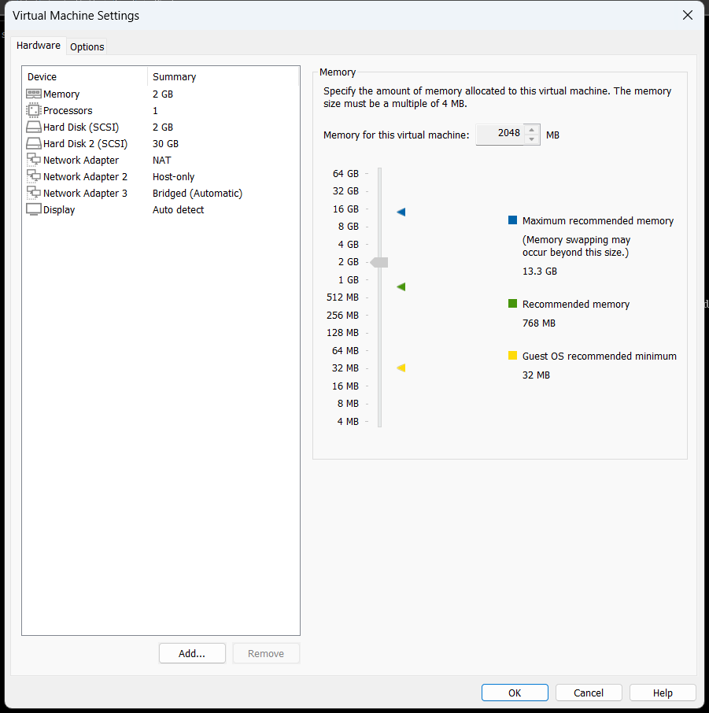

## Configure Network Interface via GUI (Option-1)
Fortinet requires two Network Interfaces, NAT and Host-only.

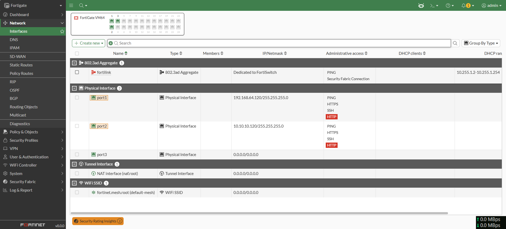
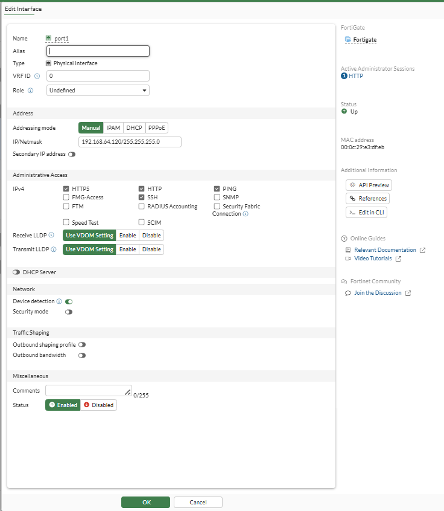
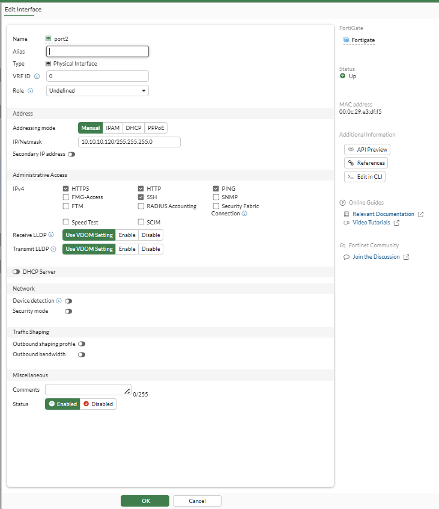

## Configure Network Interface via Command Line (Option-2)

### Port1 (NAT Interface)
```
config system interface
edit port1
set mode static
set ip 192.168.64.120 255.255.255.0
set allowaccess ping https ssh http
next
end
```

### Port2 (Host-only Interface)
```
config system interface
edit port2
set mode static
set ip 10.10.10.120 255.255.255.0
set allowaccess ping https ssh http
next
end
```

### Configure Default Route

```
config router static
edit 1
set gateway 192.168.64.2
set device port1
next
end
```

## Create Cusom Policy

### Firewall Policy via GUI

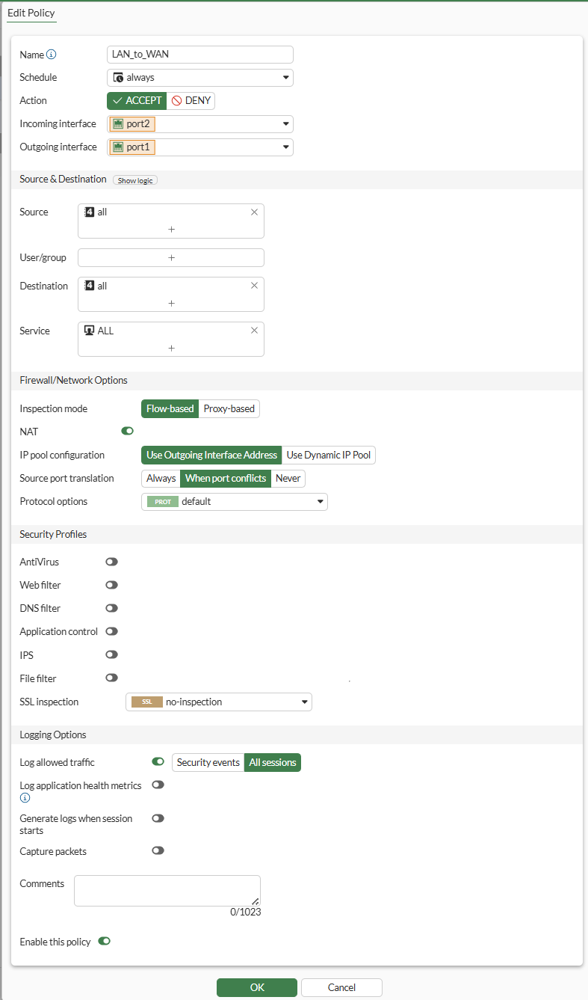

### Firewall Policy via CLI
```
config firewall policy
edit 1
set name "LAN_to_WAN"
set srcintf "port2"
set dstintf "port1"
set srcaddr "all"
set dstaddr "all"
set action accept
set schedule "always"
set service "ALL"
set nat enable
next
end
```


## Forward Traffic to Syslog Server

> [!NOTE]
> First configure a Syslog server and get the Syslog server IP Address.

```
config log syslogd setting
set status enable
set format cef
set port 514
set server 192.168.64.110
end
```
# Log Generator Server
> [!NOTE]
> Server Should be at Host-only Interface

## Add Interface in VMware
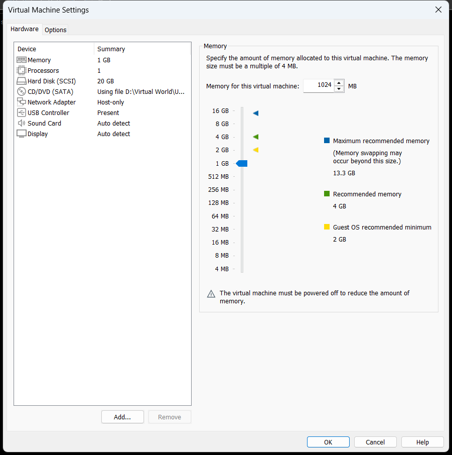


## Configure Netplan for Static IP

**Location:** `/etc/netplan/50-cloud-init.yaml`

```
network :
  version: 2
  renderer: networkd

  ethernets:
    ens33:
      addresses:
        - 10.10.10.100/24
      routes:
        - to: default
          via: 10.10.10.120 # Gateway is firewall Host-only IP
      nameservers:
        addresses:
        - 8.8.8.8
        - 1.1.1.1
```
Then 

```
netplan apply
```

# Syslog Server
## Add Interface in VMware

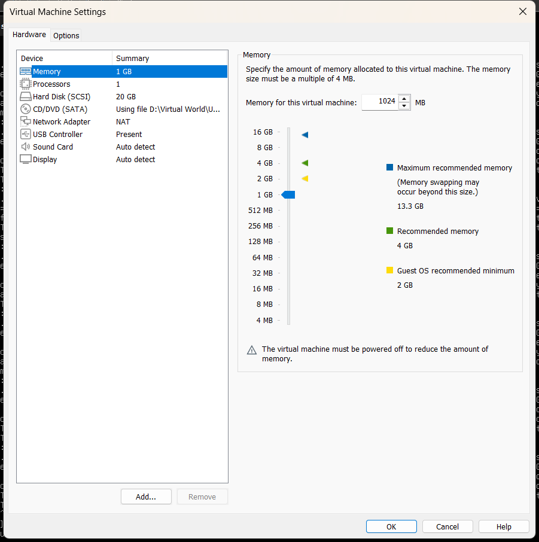


## Configure Netplan for Static IP

**Location:** `/etc/netplan/50-cloud-init.yaml`

```
network:
  version: 2
  renderer: networkd
  ethernets:
    ens33:
      addresses:
        - 192.168.64.110/24
      routes:
        - to: default
          via: 192.168.64.2
      nameservers:
        addresses:
          - 8.8.8.8
          - 1.1.1.1
```
Then 
```
netplan apply
```

Check Gateway : `ip route`

Check DNS Server : `resolvectl`

# Testing
## On Log Generator Server

```
ping 1.1.1.1
curl facebook.com
```

## Check on Firewall 

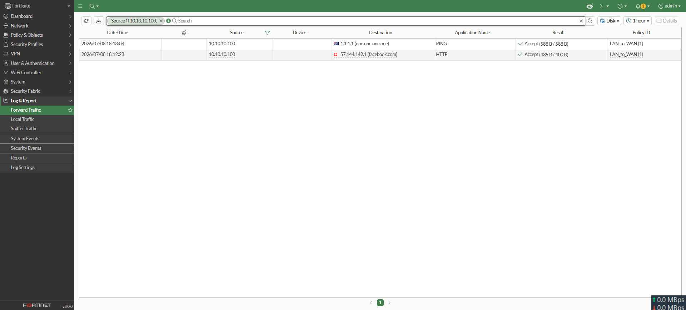

## Check on Syslog Server
Firewall log forwards to syslog server in CEF format.  
Destination shows the Facebook IP address.

```bash
sudo tail -f /var/log/syslog | grep -i fortigate
```
**Output:**
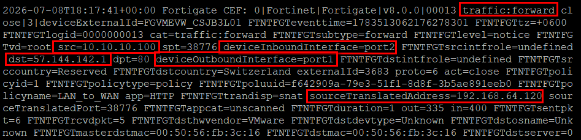


## Architecture So Far:
```
Log Generator 
    |
    ▼
FortiGate 
    |
    ▼
Syslog Server
```


# Onboard Syslog Server to Azure Arc

## Prerequisites
- An Azure subscription
- A resource group
- A Log Analytics workspace
- Microsoft Sentinel enabled on the workspace
- Outbound HTTPS connectivity from the Ubuntu server to Azure
- Sufficient Azure permissions to onboard the server and configure the connector

## Onboard the Syslog Server to Azure Arc
1. In the Azure portal, open **Azure Arc > Machines**.

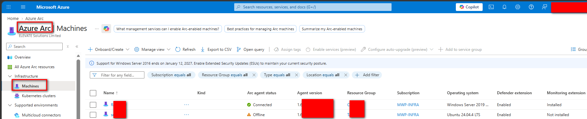


1. Add the machine by following the steps.

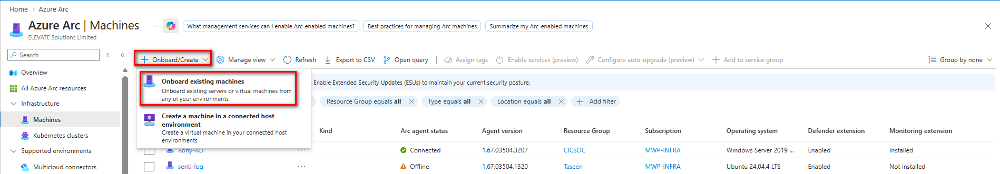

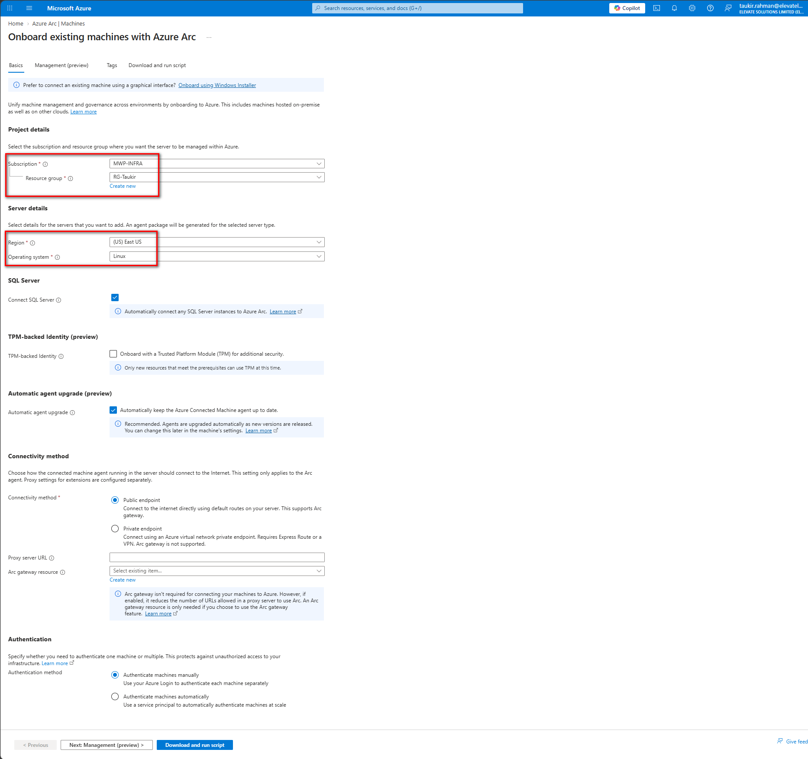

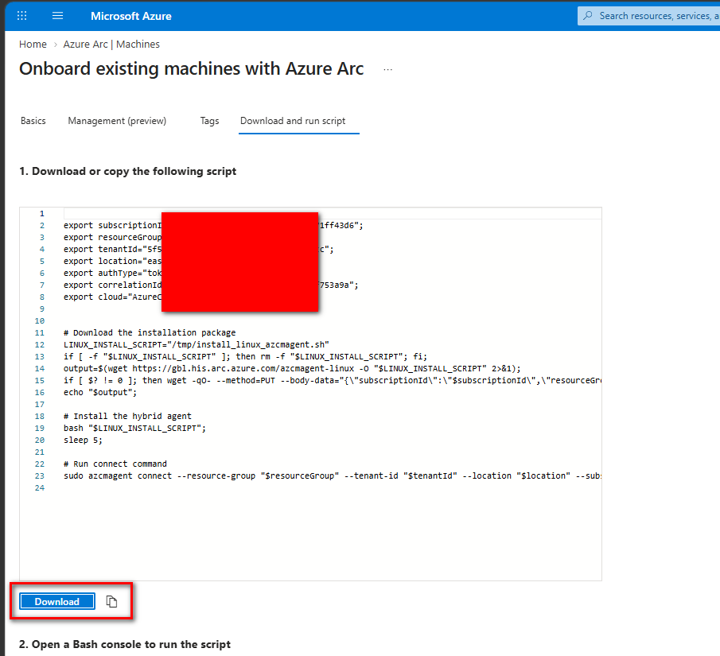

3. Run the generated script on the `Ubuntu Syslog server` with `sudo`.
4. Return to **Azure Arc > Machines** and confirm that the machine status is **Connected**.

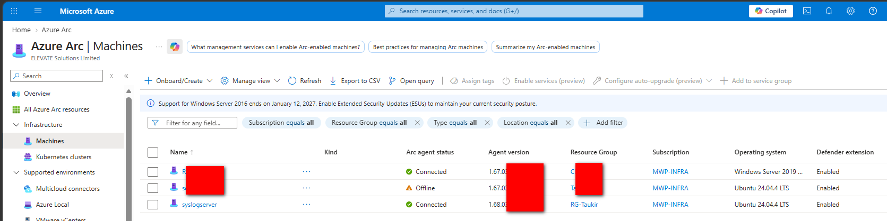


## Enable AMA extension
1. Open Onboarded Linux machine
2. Open **Settings** >> **Extensions**

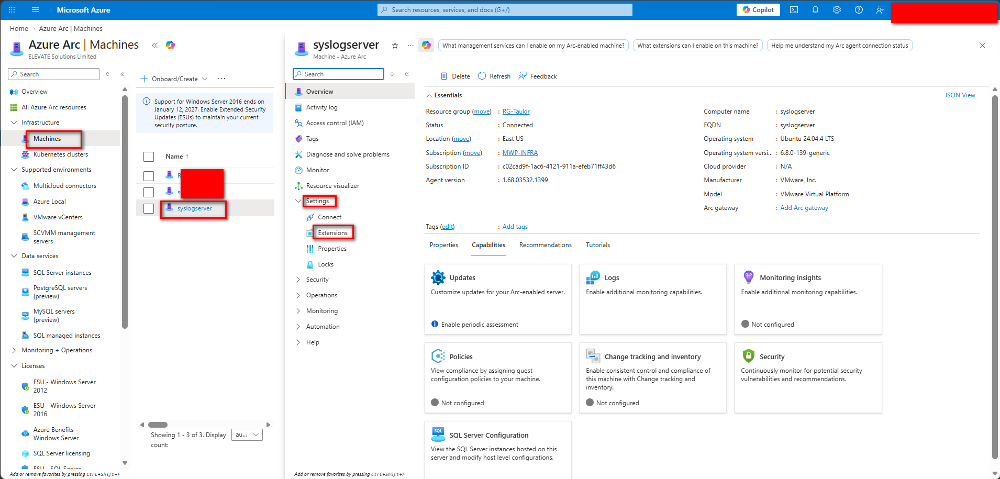

3. Enable **Azure Monitor Agent for Linux**

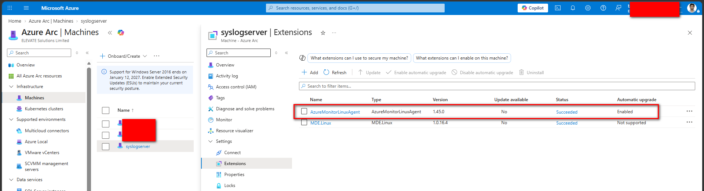


## Bonus

**To Off-board machine from Azure Arc**

Verify the current connection: 
```
azcmagent show
```
Off-board from Azure Arc:
```
azcmagent disconnect
```

# Microsoft Sentinel Configuration

## Add Data Connector
1. Open **Data Connectors**  
   Add:
   - Common Event Format (CEF) via AMA

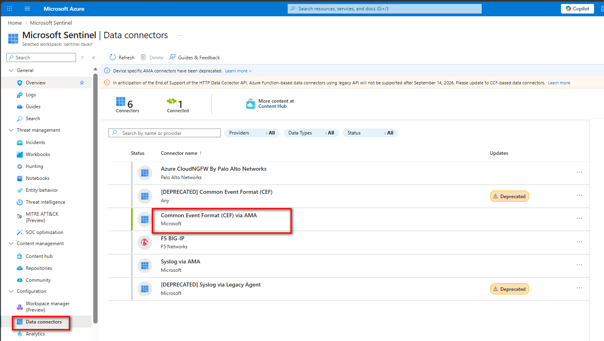

### Create the Data Collection Rule (DCR)

1. On the connector page, select **Create data collection rule**.

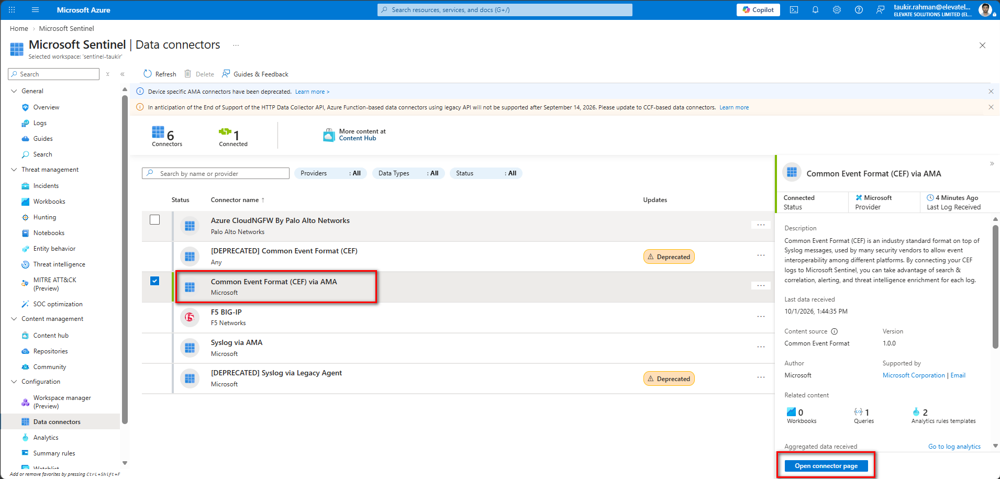

2. Click on **Create data collection rule**

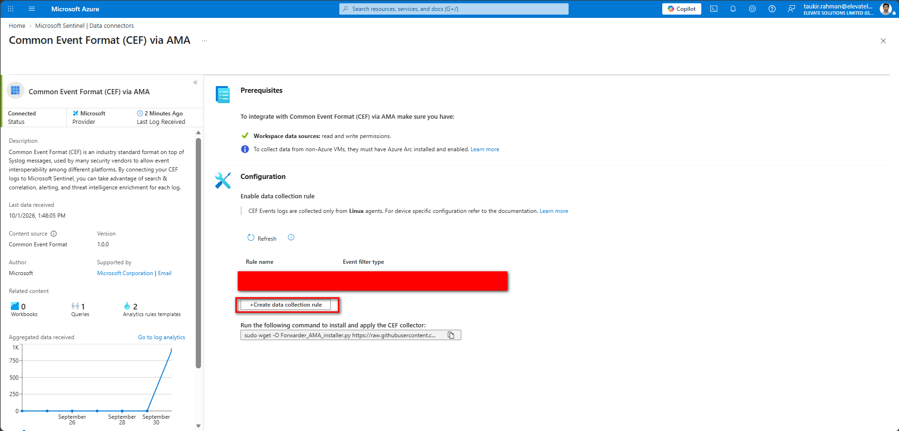


3. Enter a name for the DCR.
4. Select the Azure subscription and resource group.
5. Under **Resources**, add the Azure Arc-enabled Ubuntu Syslog server.

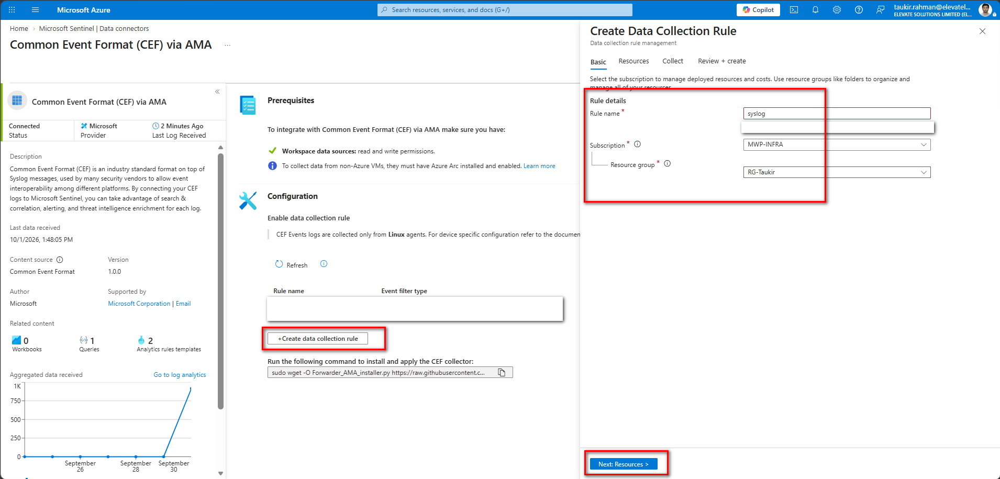


6. Under **Collect** tab, for **LOG_LOCAL7** facility, select **LOG_NOTICE** to get FortiGate events.

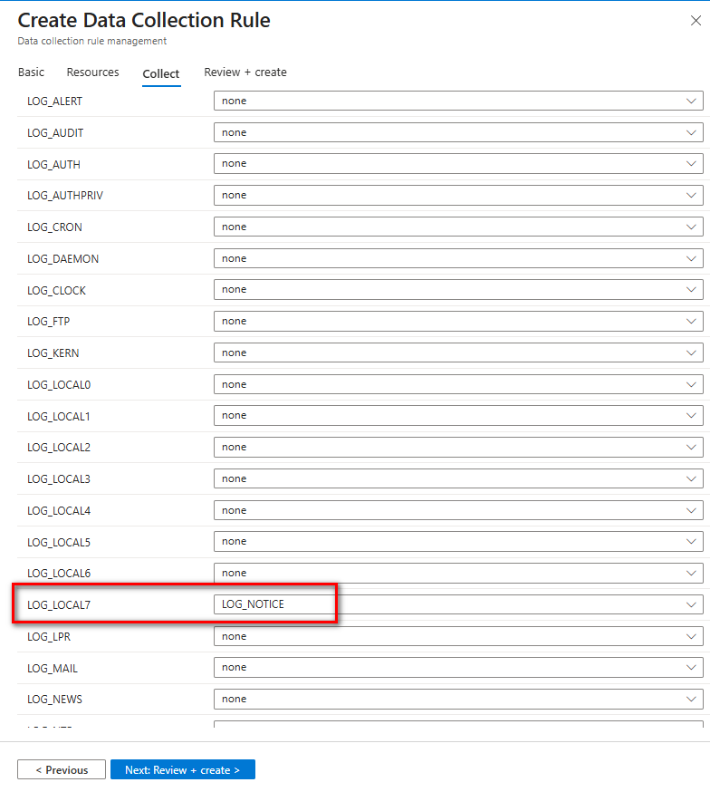

7. Create the DCR.

### Install the Fortinet Solution

1. Open Microsoft Sentinel for the target Log Analytics workspace.
2. Open **Content hub**.
3. Search for **Fortinet FortiGate Next-Generation Firewall**.
4. Install the solution.

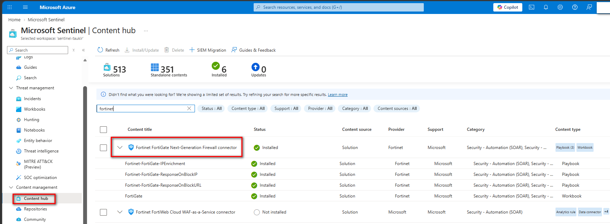


### Install the CEF Collector

The connector page generates the current CEF collector installation command for the selected Linux forwarder.

1. Copy the command displayed under `Create data collection rule`.
2. Run the generated command on the **Ubuntu Syslog server** with `sudo`.

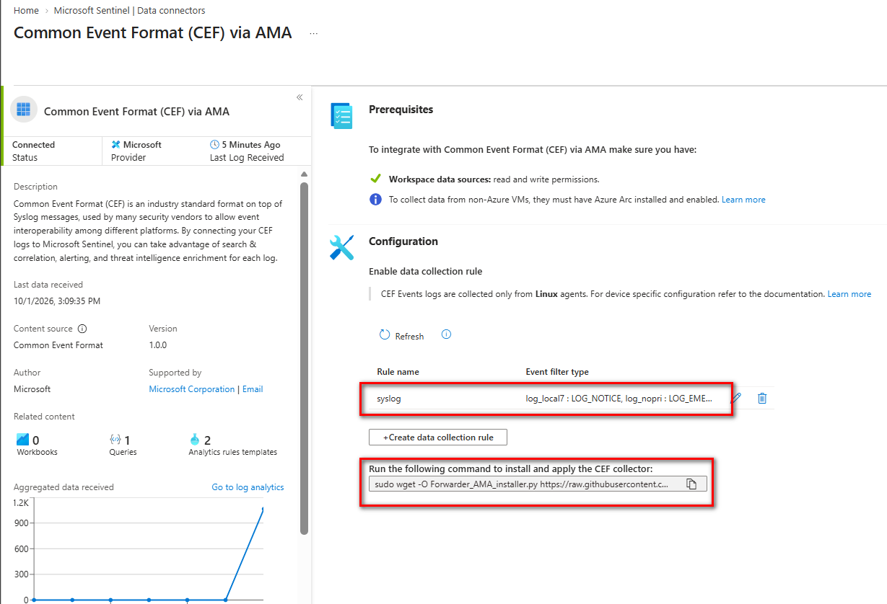

Check the AMA service:

```bash
sudo systemctl status azuremonitoragent --no-pager
```

Check the agent log for recent errors:

```bash
sudo tail -n 100 /var/opt/microsoft/azuremonitoragent/log/mdsd.err
```


## Validate Logs in Microsoft Sentinel

Generate new traffic from the log-generator server after AMA and the DCR are configured:

```bash
ping 1.1.1.1
curl google.com
```

Open **Logs** in Microsoft Sentinel or the connected Log Analytics workspace and run:

```sql
CommonSecurityLog
| where TimeGenerated > ago(30m)
| where DeviceVendor =~ "Fortinet"
| order by TimeGenerated desc
```


# Troubleshooting

1. Check the actual Syslog PRI/facility

Run on syslogserver:
```
sudo tcpdump -i any port 514 -A -vv
```

Then generate traffic again from Ubuntu-server-01:

```
curl google.com
```

Expected Output (if local7 is selected as Facility in DCR):

```
Facility local7 (23), Severity notice (5)
```

and the actual packet starts with:

```
<189>Sep 30 17:13:18 Fortigate CEF:0|Fortinet|Fortigate|...
```


Current Steps:

```
Ubuntu generator
      ↓
FortiGate
      ✅
      ↓ UDP 514 / CEF
Syslog server
      ✅
      ↓
RSyslog
      ✅ receives LOCAL7.NOTICE
      ↓
DCR: LOCAL7 / NOTICE
      ✅ correct
      ↓
AMA
      ❓
      ↓
CommonSecurityLog
      ❌
```


The problem is now between RSyslog → AMA → DCR/workspace.


2. On syslogserver, run these:

On syslogserver, run these:
```
sudo cat /etc/rsyslog.d/10-azuremonitoragent-omfwd.conf

sudo rsyslogd -N1
```

3. Restart AMA and rsyslog

Run on syslogserver after the DCR deployment completes:

```bash
sudo systemctl restart azuremonitoragent
sudo systemctl restart rsyslog
sudo systemctl status azuremonitoragent --no-pager
sudo systemctl status rsyslog --no-pager
```

Verify that the DCR reached the server

```bash
sudo grep -i -r "SECURITY_CEF_BLOB" /etc/opt/microsoft/azuremonitoragent/config-cache/configchunks
```

4. In Sentinel, run:

```sql
Heartbeat
| where TimeGenerated > ago(1h)
| where Computer =~ "syslogserver"
| order by TimeGenerated desc
```
