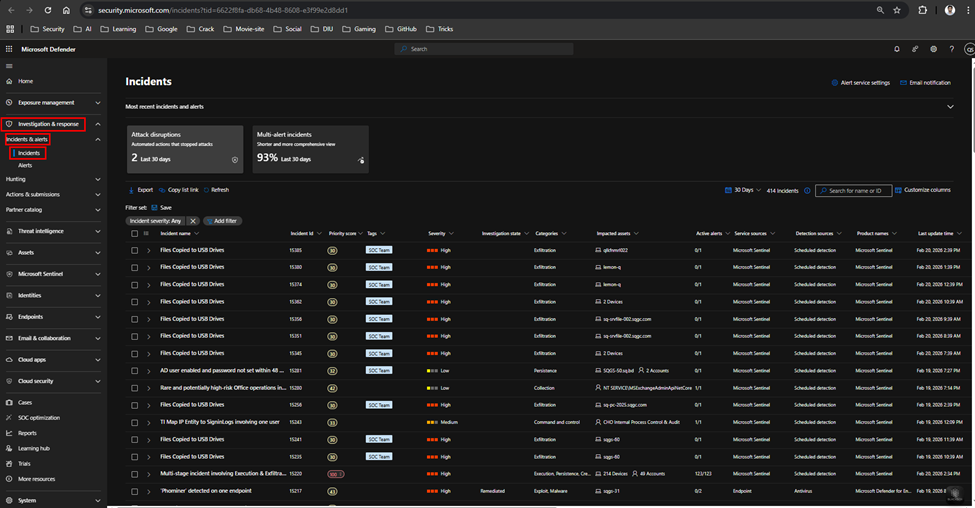
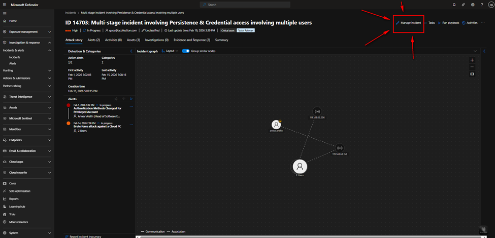
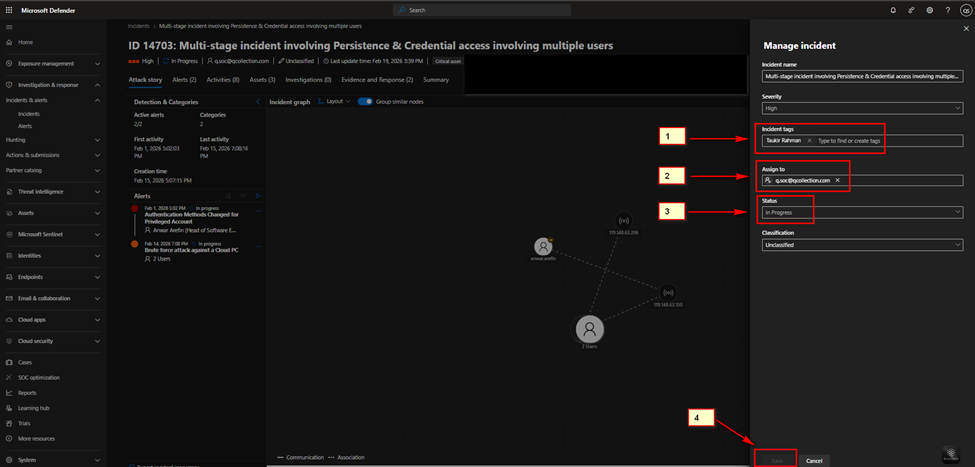
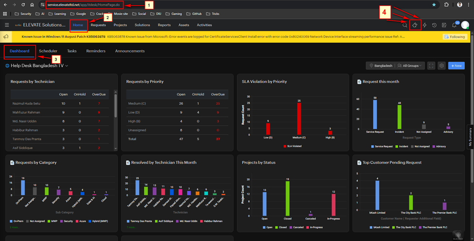
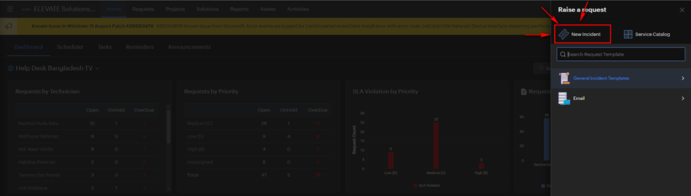
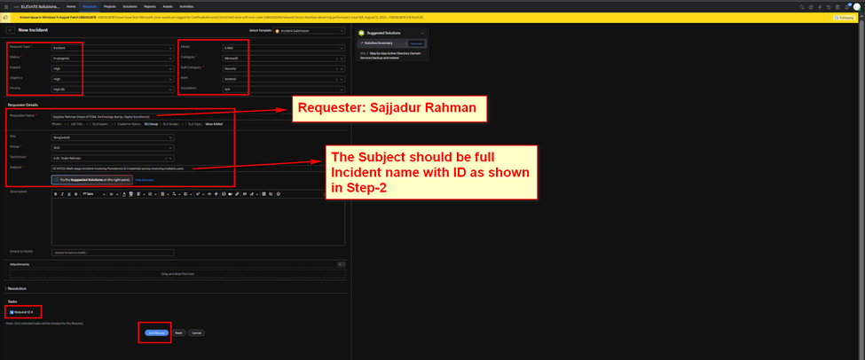
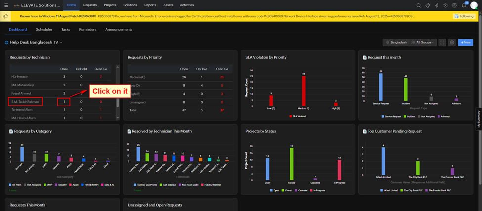
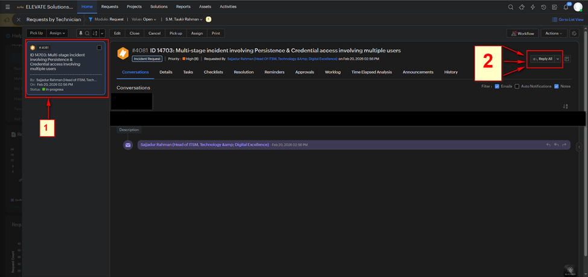
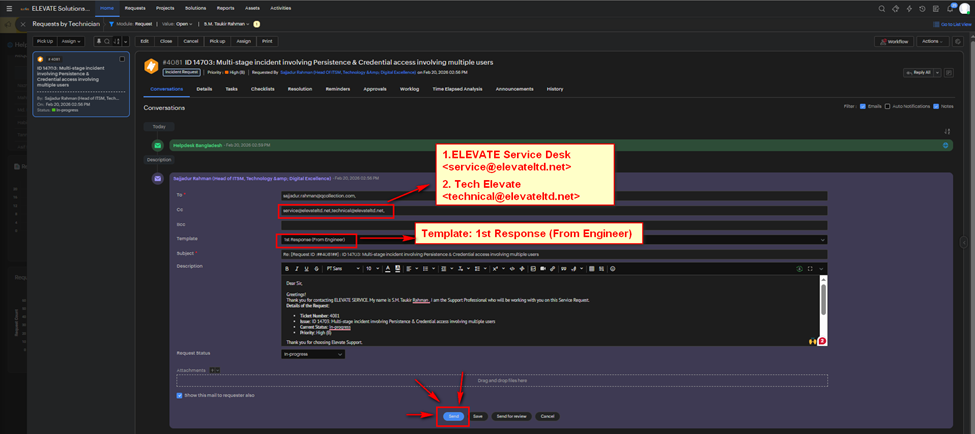

# Microsoft Ticket Raising Guideline

## 1.	Look for incidents from Microsoft Defender:

[Microsot Defender link](https://security.microsoft.com)

## 2.	Select you want to investigate and Click on Manage incident:

## 3.	Configure “Manage Incident” window:

## 4.	Raise ticket from “Service Desk”:

[Service Desk Link](https://service.elevateltd.net/)

